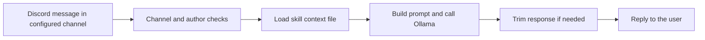

# AOSSIE Skill Bot

Local Discord assistant for AOSSIE contributor support.

The bot listens in one configured Discord channel, loads mentor guidance from a local skill file, and generates replies using a local Ollama model.

## What This Repository Contains

- MVP bot runtime in `bot.py`
- Local mentor policy and context in `.clinerules`
- Startup helper for hidden Windows launch in `start_bot_hidden.vbs`
- Forward-looking implementation plan in `roadmap.md`
- Architecture and runtime summary in `mvp_overview.md`

## Core MVP Features

- Single-channel safety scope (replies only where configured)
- Ignores bot-authored messages
- Local inference through Ollama (no cloud API required)
- Skill-context aware responses via `SKILL_FILE_PATH`
- Typing indicator while generating replies
- Startup recovery for missed user messages
- Async runtime with timeout and request error handling
- Response length guard for Discord message limits

## High-Level Flow



What this shows:

- Bot behavior is intentionally narrow and safe.
- Prompt context is local and file-driven.
- Inference and response generation remain on the local machine.

## Requirements

- Python 3.8 or newer
- Ollama installed and running locally
- Discord bot token with Message Content Intent enabled

## Quick Start

1. Clone and enter the project folder.
2. Create and activate a virtual environment.
3. Install dependencies.
4. Configure environment variables.
5. Start Ollama and run the bot.

Windows (PowerShell):

```powershell
python -m venv venv
.\venv\Scripts\Activate.ps1
pip install -r requirements.txt
Copy-Item .env.example .env
```

Linux or macOS:

```bash
python -m venv venv
source venv/bin/activate
pip install -r requirements.txt
cp .env.example .env
```

Start Ollama model (example):

```bash
ollama run llama3.2
```

Run the bot:

```bash
python bot.py
```

## Environment Configuration

Create `.env` from `.env.example` and set values:

| Variable | Required | Default | Description |
|---|---|---|---|
| DISCORD_TOKEN | Yes | None | Discord bot token |
| DISCORD_CHANNEL_ID | Yes | None | Target channel ID the bot listens to |
| OLLAMA_MODEL | No | llama3.2 | Local model name |
| SKILL_FILE_PATH | No | .clinerules | Skill/context source file |

## Startup and Recovery Behavior

On startup, the bot:

1. Logs into Discord.
2. Waits for Ollama health endpoint to return success.
3. Fetches channel history.
4. Finds the last message sent by the bot.
5. Replays missed non-bot messages in order.
6. Switches to live message handling.

This prevents dropped interactions when the process is restarted.

## Project Structure

```text
aossie-bot/
   bot.py
   .clinerules
   .env.example
   requirements.txt
   roadmap.md
   mvp_overview.md
   public/
      terminal.png
      msg_quene_offline_machine.png
      answer_when_online.png
   start_bot_hidden.vbs
```

## Running Hidden on Windows

Use `start_bot_hidden.vbs` to launch the bot process without opening a visible terminal window.

Before using it:

- Ensure the path inside the VBS file matches your local project location.
- Ensure the virtual environment exists at `venv/Scripts/python.exe`.

## Troubleshooting

- Bot does not reply:
   - Verify `DISCORD_TOKEN` and `DISCORD_CHANNEL_ID`.
   - Confirm Message Content Intent is enabled in Discord Developer Portal.
- Ollama connection errors:
   - Ensure Ollama is running on localhost:11434.
   - Confirm the configured model exists locally.
- Slow replies:
   - Local model inference speed depends on hardware and selected model size.

## Documentation

- MVP architecture: `mvp_overview.md`
- Implementation roadmap: `roadmap.md`

## Current Scope and Next Steps

Current implementation is MVP-first and single-channel by design.

Planned enhancements are tracked in `roadmap.md`, including:

- Thread-per-query isolation
- Mention mode outside ai-chat
- Gap signal logging for Skill Updater integration
- Multi-repo skill scaling
