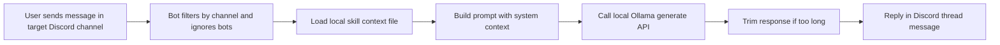
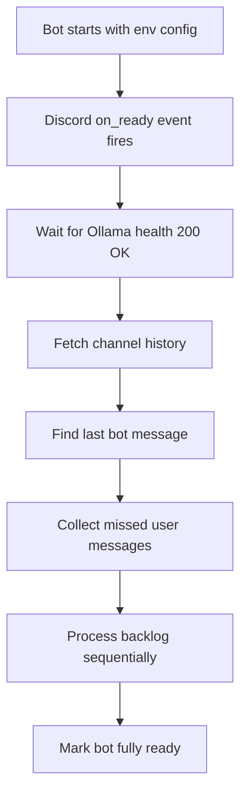
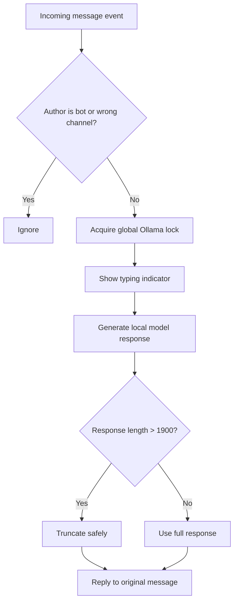
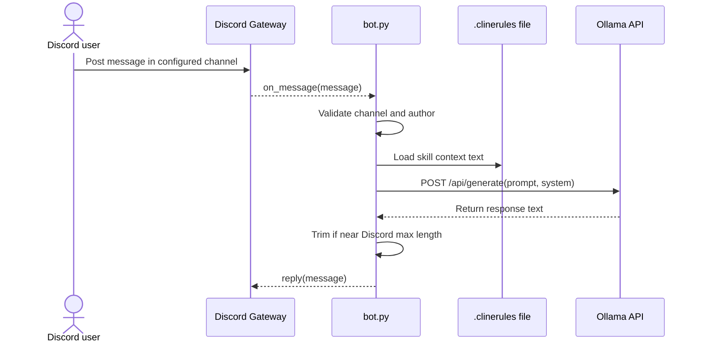
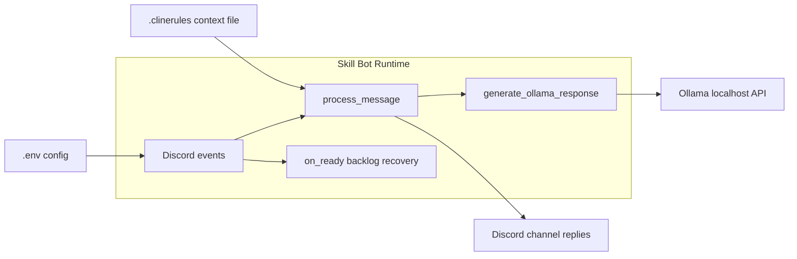

# Skill Bot MVP overview

This document summarizes the current MVP implementation in this repository.

It is written as a module view (not a future-state roadmap):

- Skill Bot reads contributor messages in one Discord channel.
- It uses local Ollama for generation.
- It applies local mentor guidance from a skill file (`.clinerules`).
- It can recover and process missed user messages when the bot comes back online.

---

## 1) End-to-End MVP

Description:

- This is the highest-level runtime loop for normal usage.
- The bot is channel-scoped and context-guided, not global across all channels.
- Inference is fully local through Ollama.

---

## 2) Startup and Recovery Flow

Description:

- This captures the offline recovery behavior implemented in startup logic.
- Missed messages are replayed after Ollama is ready.
- Recovery prevents silent gaps when the process restarts.

---

## 3) Message Processing Guardrails

Description:

- The lock guarantees one active model request at a time.
- Typing status improves UX during local generation latency.
- Reply-length guard prevents Discord message limit issues.

---

## 4) Runtime Sequence (Module Interaction)

Description:

- This diagram shows exact call order at runtime.
- `bot.py` is the orchestrator; Discord and Ollama are external dependencies.
- `.clinerules` is a local policy/context source used per reply.

---

## 5) Component Architecture (Current MVP)

Description:

- Shows current boundaries in this repository.
- Runtime behavior is concentrated in a single module (`bot.py`).
- Config and skill context are file-based for simple local operation.

---

## 6) Key info

1. MVP is intentionally single-channel (`DISCORD_CHANNEL_ID`) for safety.
2. Replies are guided by local context from `SKILL_FILE_PATH` (default `.clinerules`).
3. Ollama is required locally at `http://localhost:11434` on the admin/mentor machine (not on user/client systems).
4. Startup includes Ollama readiness polling before backlog processing.
5. Backlog replay uses channel history and last bot message heuristics.
6. A global async lock serializes model calls to avoid request clashes.
7. Error handling covers timeout, request failures, and unexpected generation errors.
8. A Windows hidden launcher script supports auto-start behavior.
9. The system is offline-resilient and queue-less by design: if the host (mentor/admin machine running Ollama locally) goes offline, messages are not lost; once back online, it checks the last bot message in the Discord channel and reconstructs pending work using channel history, effectively forming a temporary in-memory queue only at runtime (not persistently stored), primarily to prevent race conditions, avoid duplicate processing, and ensure correct message ordering.
