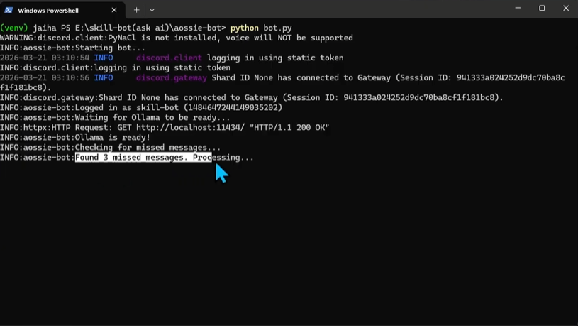
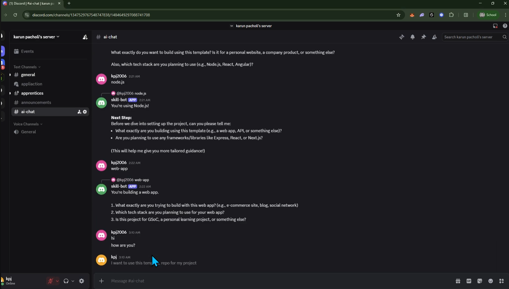
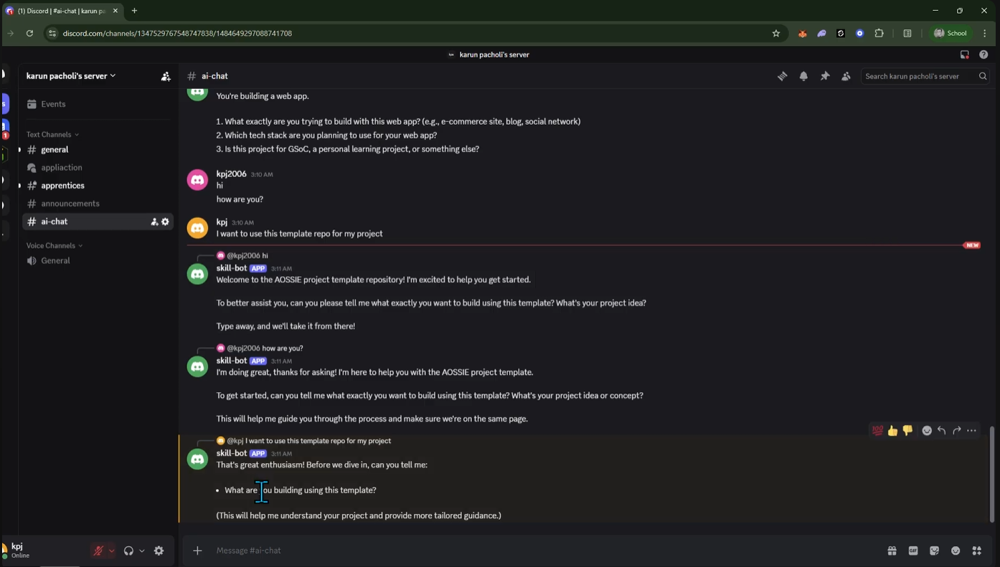
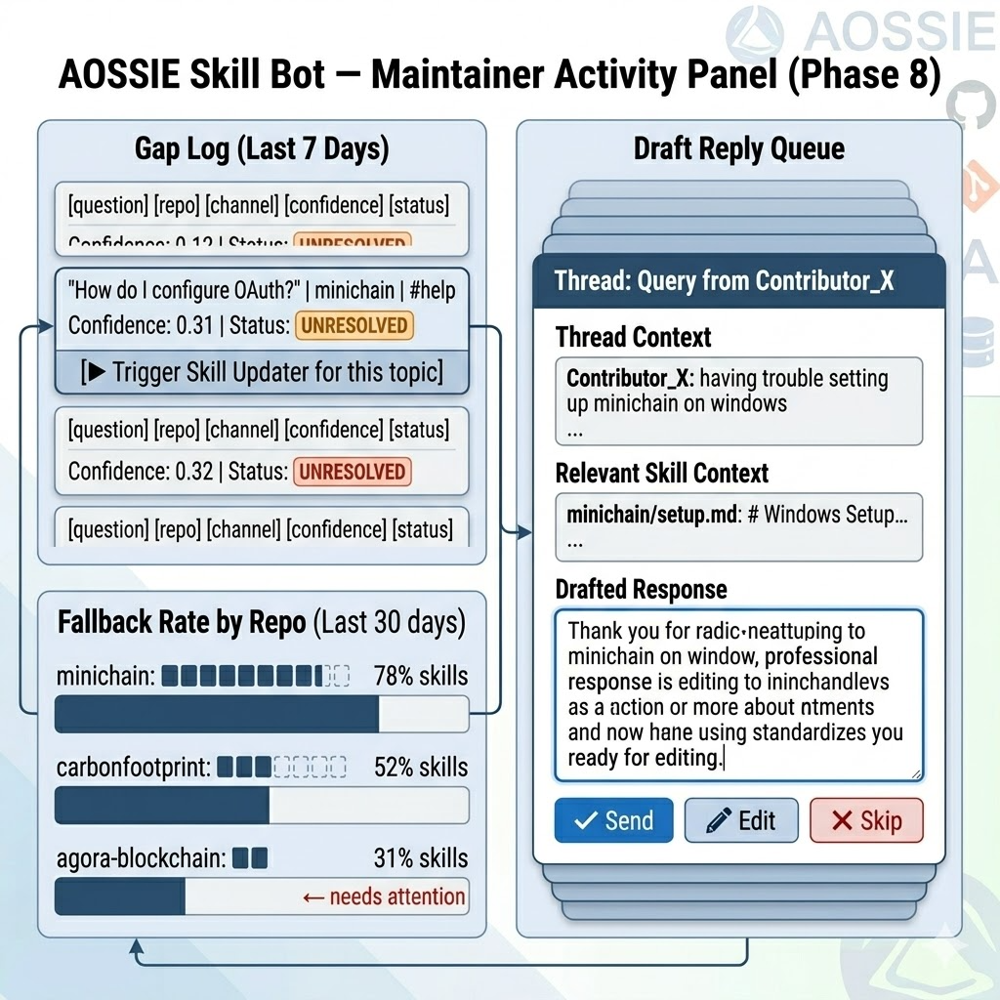

# Skill Bot — ROADMAP

> **Module:** Skill Bot (Discord Assistant)
> **Role in System:** Consumes Skills Core → answers contributor questions → emits gap signals to Skill Updater
> **Design Constraint:** Fully local (Ollama), skills-first answers, thread-scoped interactions, zero channel pollution

---

## Current State (v1 — Local Skills Assistant)

inspired from https://youtu.be/_oRNrzSlw8I

### POC demonstration:

 
    Shows the bot startup and health sequence in PowerShell: Discord login succeeds, Ollama endpoint returns `200 OK`, model readiness is confirmed, and the bot starts processing missed messages (`Found 3 missed messages. Processing...`). This validates local runtime readiness and offline message recovery flow.

 
    Shows the Discord `#ai-chat` conversation where the user provides iterative inputs (`node.js`, then `web-app`) and the bot responds with staged clarifying prompts (project type, framework, and context questions). This demonstrates multi-turn clarification behavior while messages are being tracked for later handling.


    Shows the bot actively responding in `#ai-chat` once online, including greetings and project-oriented follow-up prompts after user messages such as `hi`, `how are you?`, and `I want to use this template repo for my project`. This validates live reply generation and context-aware conversational continuity.

Tutorial: https://www.youtube.com/watch?v=vqRAfOL3Hgw

The existing bot is intentionally minimal and safe:

```
Discord message → role/channel filter → cosine similarity against skill files (Ollama)
→ skills-based answer OR LLM fallback → reply in #ai-chat
```

**What works well:**
- Fully local — Ollama handles all inference, no API costs
- Skills-first: answers grounded in maintainer-validated skill files before any LLM fallback
- Dedicated `#ai-chat` channel — no pollution of normal human conversations
- Scoped to AOSSIE template repo — setup, README, and common contributor questions
- Only reads new messages — no re-processing overhead
- Auto-start on system boot via `.vbs` launcher

**Known limitations that the roadmap addresses:**
- No thread-per-query — all replies in same channel, context bleeds between users
- No clarifying question flow — bot answers immediately without understanding intent
- Cannot be tagged in normal channels — maintainers must redirect users manually
- No gap signal emitted — when bot falls back to LLM, Skill Updater never learns about it
- Single-repo skill file — no per-repo scaling without code changes
- No mentor draft assist — maintainers still write all replies manually
- No agent integration — bot cannot self-improve or delegate to specialized agents

---

## Phase 0 — Stability Hardening (Current Sprint)

**Goal:** Make v1 production-safe and thread-aware before adding intelligence.

**Tasks:**

- [ ] Thread-per-query — every user interaction spawns a dedicated thread, continuous context preserved per user
- [ ] Deduplication guard — same question asked twice in same thread → reference previous answer, no re-processing(cache concepts)
- [ ] Graceful LLM fallback logging — when skills answer confidence < threshold, log query + channel + timestamp
- [ ] Auto-start reliability — `.vbs` launcher with process monitor; restart on crash
- [ ] Rate limit guard — one active thread per user at a time, queue overflow messages

```python
# Thread-per-query pattern
async def handle_message(message):
    # Create a thread for each new query
    thread = await message.create_thread(
        name=f"Query from {message.author.display_name}",
        auto_archive_duration=60  # minutes
    )
    response = await resolve_query(message.content)
    await thread.send(response)
```

```python
# Gap signal logging — emitted when bot falls back to LLM
if response_source == "llm_fallback":
    gap_log.append({
        "question": user_query,
        "channel": ctx.channel.name,
        "timestamp": datetime.utcnow().isoformat(),
        "confidence": similarity_score,
        "repo": extract_repo_context(ctx)
    })
    # Written to gap_log.json — consumed by Skill Updater Phase 3
```
* have a look at tutorial titled How to create a Discord Chat Bot with Ollama [Python]: https://www.youtube.com/watch?v=f5VTTwbTz28

---

## Phase 1 — Mentor-Style Clarifying Questions

> **System alignment:** A skills-first bot that answers immediately without understanding intent will give generic answers. Mentor-style interaction — asking one clarifying question before answering — dramatically improves answer precision and reduces LLM fallback frequency.

**Goal:** Before answering, the bot asks one focused clarifying question when the query is ambiguous. This mirrors how a senior maintainer would respond in Discord.

**Flow:**

```
User query → intent classifier → ambiguity score
→ if ambiguous: ask one clarifying question → user replies in thread
→ refined query → skill lookup → answer
→ if clear: answer immediately
```

**Implementation:**

```python
CLARIFY_PROMPT = """
You are a mentor assistant. Given this contributor question, decide:
1. Is it clear enough to answer directly? → respond: {{"action": "answer"}}
2. Is one clarifying question needed? → respond: {{"action": "clarify", "question": "..."}}

Only ask ONE question. Keep it specific. Do not ask for information already in the query.

Contributor question: {query}
"""

async def maybe_clarify(query: str, thread) -> str:
    result = ollama_json(CLARIFY_PROMPT.format(query=query))
    if result["action"] == "clarify":
        await thread.send(result["question"])
        reply = await wait_for_reply(thread)  # wait for user response
        return f"{query}\n\nAdditional context: {reply}"
    return query
```

**Example interaction:**

```
User: "How do I set up the project?"

Bot (clarifying): "Are you setting up for local development, 
                   or deploying to a server?"

User: "Local development"

Bot: [answers with setup/local skill file content]
```

**Why this matters for the system:**

Fewer LLM fallbacks → fewer gap signals emitted → Skill Updater is not flooded with noise. Higher-quality gap signals (from genuinely missing knowledge) are more actionable.

---

## Phase 2 — Inline Mention Mode (Normal Channel Support)

> **System alignment:** Currently the bot only operates in `#ai-chat`. Maintainers still have to manually redirect contributors who ask repetitive questions in `#general` or `#gsoc`. This phase enables contextual inline response when a maintainer tags the bot.

**Goal:** Maintainers can tag `@SkillBot` in any channel for obvious/repetitive queries. Bot replies in a thread without polluting the channel.

**Two trigger modes:**

| Mode | Trigger | Reply location |
|---|---|---|
| Dedicated | User posts in `#ai-chat` | Thread within `#ai-chat` |
| Inline | Maintainer tags `@SkillBot` in any channel | Thread on original message |

**Implementation:**

```python
@bot.event
async def on_message(message):
    # Mode 1: dedicated #ai-chat channel
    if message.channel.name == "ai-chat" and not message.author.bot:
        await handle_query(message)

    # Mode 2: inline mention in any channel by maintainer
    if bot.user in message.mentions and is_maintainer(message.author):
        # Strip the mention, extract the actual question
        query = message.content.replace(f"<@{bot.user.id}>", "").strip()
        # Check if there's a replied-to message to use as context
        context = ""
        if message.reference:
            ref_msg = await message.channel.fetch_message(message.reference.message_id)
            context = ref_msg.content
        await handle_query(message, query=query, context=context)
```

**Behavior rules:**
- Bot NEVER replies directly in the channel — always creates a thread
- Thread is attached to the original message that triggered the mention
- If the maintainer tagged the bot on a contributor's message, that message becomes the query context
- Bot does not respond to other bots or its own messages

**Why this matters for the system:**

Maintainers save time on repetitive questions without changing their workflow. The bot intercepts knowledge-gap moments at the exact point they occur in natural Discord conversation.

---

## Phase 3 — Per-Repo Skill Scaling

> **System alignment:** Skills Core is designed to scale per-repo via structured `skills/` directories. The bot should dynamically load the correct skill set based on which repo's channel it's operating in — no code changes needed to add a new repo.

**Goal:** One bot instance, multiple repos. Skill set loaded dynamically per channel → per repo mapping. Adding a new repo requires only a new `skills/` directory, not a new bot deployment.

**Current flow:**
```
Bot starts → loads one hardcoded skills/ directory → answers for one repo
```

**New flow:**
```
Bot starts → loads channel → repo mapping
→ per message: detect channel → load matching skills/ directory
→ answer using repo-specific skill files
```

**Configuration:**

```python
# config.yaml — no code changes needed to add repos
repo_channels:
  "aossie-general": "skills/aossie-org"
  "minichain-help": "skills/minichain"
  "carbonfoot-dev": "skills/carbonfootprint"
  "agora-questions": "skills/agora-blockchain"
  "gsoc-help": "skills/gsoc-specific"
```

**Implementation:**

```python
import yaml

with open("config.yaml") as f:
    config = yaml.safe_load(f)

CHANNEL_SKILL_MAP = config["repo_channels"]

def get_skill_path(channel_name: str) -> str:
    return CHANNEL_SKILL_MAP.get(channel_name, "skills/default")

async def handle_query(message):
    skill_path = get_skill_path(message.channel.name)
    skill_files = load_skills(skill_path)
    answer = resolve_with_skills(message.content, skill_files)
    await reply_in_thread(message, answer)
```

**ChromaDB integration (aligned with Skill Updater Phase 2 and PR Dashboard Phase 1):**

```python
import chromadb

client = chromadb.PersistentClient(path="./chroma_skills")

# Collection per repo — loaded at startup, updated on git pull
def index_repo_skills(repo_name: str, skill_path: str):
    collection = client.get_or_create_collection(repo_name)
    for skill_file in glob(f"{skill_path}/**/*.md"):
        content = open(skill_file).read()
        collection.upsert(
            ids=[skill_file],
            embeddings=[embed(content)],
            documents=[content]
        )

# Query the right collection per channel
def resolve_with_skills(query: str, repo_name: str) -> str:
    collection = client.get_collection(repo_name)
    results = collection.query(query_embeddings=[embed(query)], n_results=3)
    return build_answer(query, results["documents"][0])
```

**Why this matters for the system:**

AOSSIE has 300+ repos. A bot that needs redeployment per repo doesn't scale. With this phase, Skill Updater improvements to any repo's `skills/` directory are automatically reflected in bot answers — no manual intervention.

---

## Phase 4 — Gap Signal Emission to Skill Updater

> **System alignment:** This is the critical feedback loop described in the global system design. When the bot cannot answer from skills and falls back to LLM, that event is a knowledge gap — and the Skill Updater should know about it. This phase formalizes that signal.

**Goal:** Every LLM fallback emits a structured gap signal to `gap_log.json`. Skill Updater reads this file and prioritizes Discord message searches around unanswered topics.

**This closes the system loop:**

```
Contributor asks question
    → Bot tries skills (miss)
    → Bot falls back to LLM
    → Gap signal emitted → gap_log.json
        → Skill Updater reads gap_log.json
        → Prioritizes Discord search for that topic
        → Finds maintainer discussion
        → Updates skill file in Skills Core
            → Bot now answers from skills next time ✓
```

**Implementation:**

```python
import json
from datetime import datetime

GAP_LOG_PATH = "gap_log.json"

def emit_gap_signal(query: str, channel: str, repo: str, confidence: float):
    entry = {
        "question": query,
        "channel": channel,
        "repo": repo,
        "timestamp": datetime.utcnow().isoformat(),
        "confidence": round(confidence, 3)
    }
    with open(GAP_LOG_PATH, "a") as f:
        json.dump(entry, f)
        f.write("\n")

# In the answer resolution flow:
async def resolve_query(query: str, repo_name: str, channel: str) -> tuple[str, str]:
    skill_answer, confidence = lookup_skills(query, repo_name)

    if confidence >= CONFIDENCE_THRESHOLD:
        return skill_answer, "skills"
    else:
        # LLM fallback
        emit_gap_signal(query, channel, repo_name, confidence)
        llm_answer = ollama_fallback(query)
        return llm_answer, "llm_fallback"
```

**Skill Updater consumes this (Phase 3 of its roadmap):**

```python
# In skill_updater.py
gap_topics = load_gap_log("gap_log.json")
discord_messages = fetch_maintainer_messages()

for msg in discord_messages:
    gap_score = max(
        cosine_sim(embed(msg["content"]), embed(gap["question"]))
        for gap in gap_topics
        if gap["repo"] == current_repo
    )
    msg["priority"] = gap_score

# Higher gap_score = this Discord message fills a real knowledge gap
# → prioritized for skill file update
```

---

## Phase 5 — GSoC-Specific Mode

> **System alignment:** GSoC contributors have a distinct set of repeated questions — proposal structure, evaluation criteria, mentor expectations, timeline. A dedicated mode with specialized skill files handles this without polluting general repo Q&A.

**Goal:** A separate `#gsoc-help` channel (or tag-triggered mode) uses GSoC-specific skill files. Bot adapts tone and answer depth for student-level contributors.

**Skill file structure for GSoC:**

```
skills/gsoc/
  proposal-structure.md     ← how to write a strong GSoC proposal for AOSSIE
  evaluation-criteria.md    ← what mentors look for
  timeline.md               ← GSoC phases, deadlines, milestones
  common-mistakes.md        ← historical rejection patterns (from Skill Updater)
  mentor-expectations.md    ← communication norms, PR standards
  faq.md                    ← top 20 repeated GSoC questions
```

**Mode detection:**

```python
def detect_mode(channel_name: str, message_content: str) -> str:
    if "gsoc" in channel_name.lower():
        return "gsoc"
    if any(kw in message_content.lower() for kw in ["proposal", "gsoc", "mentor", "stipend"]):
        return "gsoc"
    return "repo"
```

**Tone adjustment for GSoC:**

```python
GSOC_SYSTEM_PROMPT = """
You are a friendly GSoC mentor assistant for AOSSIE. 
The user is a student contributor. Be encouraging, clear, and specific.
Always suggest next steps. Never give a one-word answer.
If the question is about proposal quality, provide concrete feedback criteria.
"""

REPO_SYSTEM_PROMPT = """
You are a technical assistant for AOSSIE contributors.
Be concise and direct. Prioritize setup instructions and code-level guidance.
"""
```

---

## Phase 6 — Mentor Draft Assist

> **System alignment:** Skill Bot doesn't replace maintainers — it assists them. This phase gives maintainers a `!draft` command that generates a reply draft based on the thread context and skill files, which the maintainer then reviews and sends (or edits).

**Goal:** Maintainers can request a draft reply to any thread. Bot generates a skills-grounded response, posts it as a draft for the maintainer to approve, edit, or discard.

**Trigger:** `!draft` command posted by maintainer in any thread.

**Flow:**

```
Maintainer types !draft in thread
    → Bot reads full thread context
    → Retrieves relevant skill files for that repo/channel
    → Generates draft reply
    → Posts draft with [✅ Send] [✏️ Edit] [❌ Discard] reactions
    → Maintainer reacts
        → ✅ Bot posts draft as official reply
        → ✏️ Bot opens edit prompt (maintainer refines, re-confirms)
        → ❌ Draft deleted, no reply sent
```

**Implementation:**

```python
@bot.command(name="draft")
@commands.check(is_maintainer)
async def draft_reply(ctx):
    # Fetch full thread history
    thread_messages = [msg async for msg in ctx.channel.history(limit=50)]
    thread_text = "\n".join(
        f"{m.author.display_name}: {m.content}"
        for m in reversed(thread_messages)
        if not m.author.bot
    )

    # Retrieve skill context
    skill_context = get_skill_context(thread_text, repo_from_channel(ctx.channel))

    draft_prompt = f"""
## Thread Context
{thread_text}

## Relevant Skill Files
{skill_context}

Generate a helpful, accurate reply a maintainer could send to close this thread.
Be specific. Reference skill file content where applicable.
"""
    draft = ollama_generate(draft_prompt)

    draft_msg = await ctx.send(
        f"**📝 Draft Reply (for maintainer review)**\n\n{draft}\n\n"
        f"React: ✅ Send  ✏️ Edit  ❌ Discard"
    )
    await draft_msg.add_reaction("✅")
    await draft_msg.add_reaction("✏️")
    await draft_msg.add_reaction("❌")
```

**Why this matters for the system:**

Maintainers are the bottleneck in open-source. Draft assist doesn't remove them from the loop — it reduces the cognitive load of composing each reply from scratch while keeping them as the final decision-maker.

---

### NOTE: The next phases (7 and 8) involve more complex system extensions (agent integration and dashboard integration) that require careful design to maintain the bot's reliability and usefulness. They are outlined in the roadmap but would need detailed planning before implementation (it will be the issues for next GSOC ).

## Phase 7 — Agent Integration (Hermes / Self-Improving)

> **System alignment:** The global system design references agent integration as a future extension. This phase formalizes it — introducing a multi-agent handoff layer where Skill Bot can delegate to specialized agents when its own skills are insufficient.

**Goal:** When Skill Bot's answer confidence is low even after LLM fallback, it can delegate to a specialized agent (e.g., Hermes for reasoning-heavy questions) or invoke a self-improvement cycle.

**Agent tiers:**

```
Tier 1: Skills lookup          → instant, no LLM
Tier 2: Ollama LLM + skills    → local, fast
Tier 3: Hermes agent           → deeper reasoning, multi-step
Tier 4: Human escalation       → tag maintainer, create issue
```

**Hermes integration (local, via Ollama):**

```python
AGENT_DISPATCH = {
    "setup": "llama3.1:8b",          # fast, good at instructions
    "architecture": "hermes3:8b",    # reasoning-heavy questions
    "gsoc_proposal": "hermes3:8b",   # structured evaluation
    "debugging": "qwen2.5-coder:7b"  # code-specific questions
}

def route_to_agent(query: str, skill_context: str) -> str:
    category = classify_query_type(query)  # simple Ollama call
    model = AGENT_DISPATCH.get(category, "qwen2.5:7b")
    return ollama_generate(query, model=model, system=skill_context)
```

**Self-improving loop (aligned with Skill Updater roadmap):**

```python
# After every LLM fallback answer — check if Skill Updater has since updated skills
def post_answer_refresh(query: str, repo: str):
    skill_answer, confidence = lookup_skills(query, repo)
    if confidence >= CONFIDENCE_THRESHOLD:
        # Skills were updated since last time this question was asked
        # Retroactively note that gap is now filled
        mark_gap_resolved(query, repo)
```

**Human escalation (Tier 4):**

```python
# If all tiers fail or confidence stays below floor threshold
async def escalate_to_maintainer(message, query: str):
    maintainer_role = discord.utils.get(message.guild.roles, name="Maintainer")
    await message.channel.send(
        f"{maintainer_role.mention} — this question needs human input:\n"
        f"> {query}\n\n"
        f"*Skill Bot could not find a confident answer from skills or LLM.*"
    )
```

---

## Phase 8 — Unified Maintainer Dashboard Integration

> **System alignment:** Mirrors Phase 7 of the PR Dashboard roadmap. Skill Bot, Skill Updater, and PR Dashboard all share a single FastAPI + HTMX maintainer interface. This phase plugs Skill Bot's activity (gap log, thread history, fallback stats) into that shared dashboard.

**Goal:** Maintainers can see, from one interface: which questions the bot couldn't answer (gap log), which repos have the most unanswered queries, draft reply queue, and trigger Skill Updater runs for specific gap topics.

**Dashboard panels for Skill Bot:**



**FastAPI endpoint:**

```python
@app.get("/skill-bot/gaps")
def get_gaps():
    return load_gap_log("gap_log.json")

@app.post("/skill-bot/trigger-update")
def trigger_skill_update(gap_id: str):
    gap = get_gap_by_id(gap_id)
    # Hand off to Skill Updater with this topic as high-priority
    skill_updater_queue.append({
        "topic": gap["question"],
        "repo": gap["repo"],
        "priority": 1.0,
        "source": "bot_gap_signal"
    })
    return {"status": "queued"}
```

---

## Technology Stack Summary

| Component | Current | Roadmap Addition |
|---|---|---|
| LLM | Ollama (local) | Multi-model dispatch via Hermes (Phase 7) |
| Embeddings | cosine similarity (flat) | ChromaDB per-repo collection (Phase 3) |
| Channel scope | `#ai-chat` only | Inline mention mode in any channel (Phase 2) |
| Interaction style | Immediate reply | Clarifying question flow (Phase 1) |
| Repo support | Single repo | Dynamic per-channel skill loading (Phase 3) |
| Gap signaling | None | `gap_log.json` → Skill Updater (Phase 4) |
| GSoC support | None | Dedicated skill files + tone (Phase 5) |
| Maintainer assist | None | `!draft` command with approval flow (Phase 6) |
| Agent routing | None | Hermes + model dispatch (Phase 7) |
| Dashboard | None | Unified FastAPI panel (Phase 8) |
| Scheduling | Manual / vbs boot | Process monitor + GitHub Actions cron |

---

## Key Design Principles (Non-Negotiable)

1. **Skills-first always** — skill file lookup before any LLM call, every time
2. **Zero channel pollution** — every reply lives in a thread, never in the channel directly
3. **Maintainer-gated actions** — draft assist, inline mode, escalation all require maintainer trigger
4. **Gap signals over silence** — every LLM fallback is a signal, never just a quiet answer
5. **Local-first** — Ollama handles all inference; no OpenAI/Anthropic API calls
6. **Scale without code changes** — adding a repo = adding a skill file, nothing else
7. **Thread context continuity** — each user query has its own thread; no cross-user context bleed

## References

- [discord.py](https://discordpy.readthedocs.io/) — Discord bot framework
- [Ollama local models](https://ollama.ai/) — Hermes3, qwen2.5, llama3.1 (all local)
- [ChromaDB persistent client](https://docs.trychroma.com/reference/py-client) — per-repo skill index (Phase 3)
- [Skill Updater Roadmap](../skill-updater/ROADMAP.md) — gap signal consumer (Phase 4)
- [PR Dashboard Roadmap](../pr-dashboard/ROADMAP.md) — shares unified dashboard (Phase 8)
- [skill-bot-ask-ai](https://github.com/kpj2006/skill-bot-ask-ai-) — Discord REST fetch pattern reference
- [BERTopic Online Learning](https://maartengr.github.io/BERTopic/getting_started/online/online.html) — clustering reference (used in Skill Updater Phase 1, informs Phase 7 routing)
